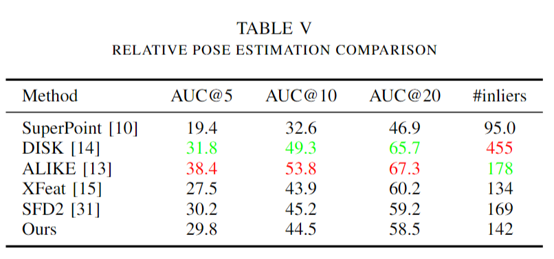

## EdgePoint: Learning Efficient Keypoint Extraction and Description for Edge Devices

**Abstract**: Image matching is one of the most fundamental tasks in computer vision, widely used in image and video processing. In recent years, data-driven methods have outperformed handcrafted approaches; however, due to their high computational demands, they have not been widely adopted in engineering applications. To fully utilize the advantages of learned keypoints  on resource-constrained edge devices, we propose a fully convolutional network architecture optimized for hardware inference efficiency, which can simultaneously extracts keypoints and descriptors. In addition, in order to adapt to the designed efficient network structure, the network training method is also redesigned. Experiments show that the proposed method achieves the highest inference efficiency across all edge devices while maintaining performance comparable to the latest state-of-the-art (SOTA) learned methods.

### Inference Efficiency

Four typical edge devices are used to test the inference efficiency of the network, representing the NVIDIA GPU, iGPU, CPU, and NPU. Jetson AGX Orin 32GB is NVIDIA's edge computing device for mobile AI devices, which is widely used in robotics, autonomous driving and other scenarios. It has 200TOPS AI performance, and a maximum GPU frequency of 1.2Ghz. The Intel core i5-1135G7 processor is an 11-generation CPU processor with a max turbo frequency of 4.2Ghz, which is widely used in notebooks and mobile robots. A mini-sized (less than 4x4 inches) onboard computer was used to carry the processor and for CPU inference efficiency testing. An additional iGPU is included in the i5-1135G7 processor and is called Intel Iris Xe Graphics. The iGPU has a maximum frequency of 1.3Ghz and 80 execution units and is used for all iGPU time tests. The RK3588 is a low-power embedded ARM (Advanced RISC Machine) processor from Rockchip that includes a 6TOPS@INT8 NPU and is used for tasks such as vision processing in mobile robots. All the execution efficiency tests on the heterogeneous NPU are performed on this platform.

  

    
    
  

### Performance

We follow the same protocols in ALIKE, estimate the Mean Homography Accuracy (MHA) and the Area Under the Curve (AUC). 

  

    
    
  

### How to use it 

### Training

